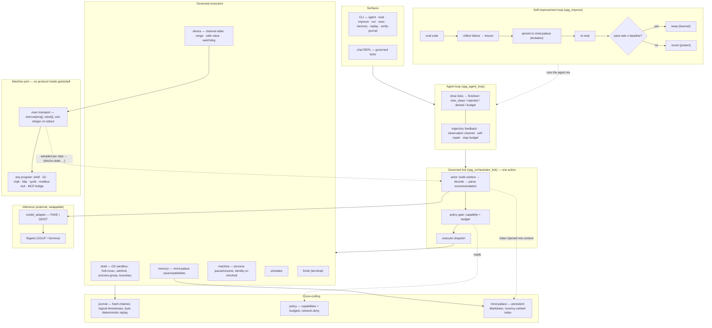

# geistshell

A **governed agent runtime** written in pure C23. geistshell is not another
"smart agent" wrapper — it is a deterministic, auditable *control plane* for
agent actions: every action a model proposes is policy‑gated, budget‑bounded,
journaled into a hash‑chained log, and replayable byte‑for‑byte. On top of that
spine sits a self‑improvement loop whose changes are accepted only if its own
evaluation harness proves they do not regress.

The language model is swappable and external (the [geist](https://github.com/geisten/geistlib)
engine, pinned). geistshell owns everything *around* the model: perception,
governance, execution, audit, memory, evaluation, and learning.

## geistshell vs geistagent — two runtimes, two jobs

They are deliberately separate because they enforce different security models;
merging them would weaken both.

| | **geistshell** (this repo) | **[geistagent](https://github.com/geisten/geistagent)** |
|---|---|---|
| Job | *execute* arbitrary governed actions (shell, scripts) and learn from them | *call* a fixed, host-supplied toolset safely |
| Action space | open — any command the policy gate + OS sandbox allow | closed — an off-list tool name never runs |
| Output model | incremental (`poll()`-drained stdout/stderr, journaled) | one atomic `tool.result` per call |
| Learning | built-in eval-gated self-improvement loop (`improve`) | offline skill miner over the same gate |
| Use it for | "write a script, run it, watch the output, react" | "turn on the hallway light" |

Rule of thumb: **bounded tool-calling → geistagent; open action execution →
geistshell.**

Device control is the exception that proves the rule: geistshell drives real
machines through a *closed* channel table (range-checked, safe-valued,
watchdogged) rather than its open action space — see Devices below.

```
make            # build (host-debug: ASan/UBSan, strict warnings)
make test       # framework-free C tests + CLI system tests
make bench      # real-model benchmark (reports "skipped" when no GGUF is present)
./build/host-debug/bin/geistshell            # CLI: agent / eval / improve / run / exec / memory / replay / seal-journal / ...
./build/host-debug/bin/geistshell-chat       # governed chat REPL
```

## Architecture



### The three loops

**1. The governed tick** (`spg_orchestrator_tick`) is the deterministic
single‑step primitive. The *actor* assembles a bounded context (graph state,
mind‑palace index, recent journal events, budgets, an action contract) and
decodes one model reply. That reply is parsed into a typed *recommendation*
(an s‑expression: `(recommend (kind …) (capability …) …)`). The *policy gate*
then decides ALLOW/DENY against capabilities and budgets — this stage is
mandatory and cannot be bypassed. An allowed action is dispatched to exactly one
executor (simulator, memory, local‑shell, machine‑process, device, or the
`finish` control action), and every step is written to the journal.

**2. The agent loop** (`spg_agent_loop`) drives ticks to termination. Each step's
result becomes an *observation* fed into the next step's context, and the full
journal trajectory is threaded back so the agent sees its own history (not just
the last result). It is goal‑driven (stops on a `finish` action), bounded by a
policy step budget, and self‑repairing: a malformed reply is fed back as a parse
error and retried instead of aborting.

**3. The self‑improvement loop** (`spg_improve`) turns evaluation failures into
durable lessons. It runs an eval suite and distills a lesson from each failing
case — keyed on the failure mode, but *earned* from that run's concrete signal
(the actual reject/deny reason and the step/repair counts, not a fixed
template). It persists the lesson tentatively into the mind‑palace,
re‑evaluates, and **keeps the lesson only if the pass count did not drop** —
otherwise it reverts. The eval harness is the acceptance gate for the agent's
own self‑modifications.

### Devices — the machine port

geistshell drives real machines and contains **no device protocol**. The entire
vocabulary is a *channel*: a name, a range, and — for a writable one — the value
it goes to when contact is lost. A new machine is a new table, not new code.

Underneath the channel sits exactly one transport, and it is the Unix one:

```
read:   execve(prog)             → one integer on stdout, exit 0
write:  execve(prog, "<value>")  → exit 0 accepts it
```

That is the whole contract. A sensor is a program that prints a number; an
actuator is a program that takes one. I²C, MQTT, HTTP, a `cat` on sysfs, an MCP
bridge, Modbus — all of it is somebody's program, none of it is geistshell's
code. The value the model chose is passed as its own `argv` entry and never
through a shell, so there is no command string anyone could forget to quote.

What stays *inside* geistshell is everything that has to be checked:

- **Range means refusal, not clamping.** An out-of-range setpoint is rejected
  (`SPG_E_LIMIT`) before a process is ever started — clamping executes a
  near-miss of an already-wrong command.
- **Every writable channel declares a safe value**, and the watchdog drives the
  plant there when contact is lost. `safe_state` attempts *all* channels and
  reports the first failure: a plant stopped halfway to safe is worse than
  either end.
- **`device` is its own capability**, separate from `machine_process` — granting
  the right to pause a runaway process never silently grants the right to open a
  valve.
- **Every outcome is journaled, refusals included.** For an irreversible action
  the record of what was *not* done counts as much as the record of what was.

Readings are **pulled**, once per tick, next to the host telemetry — no daemon,
no socket, no signal. Push would make the value depend on *when* the sensor
wrote (killing byte-identical replay), let a foreign process decide when
geistshell is interrupted, and turn a dead sensor into silence that is
indistinguishable from an unchanged value. An event too short for one tick is a
*latching* sensor program's job, not a push channel's.

Why not MCP: the local model produces valid actions because `grammar_mask.c`
masks the decoder per token against a small, start-time-known vocabulary.
Arbitrary JSON-Schema tools would require a schema→token-mask compiler to keep
that property, and the range/safe checks would move out of tested C into the
server. An MCP server is reachable as a **bridge program** on an exec channel
instead — geistshell never learns JSON-RPC.

See [docs/machine-intelligence/Devices.md](docs/machine-intelligence/Devices.md)
for the full contract, the s-expression channel config, and the migration order.
Current state: the channel table, range/safe/watchdog and
`SPG_ACTION_DEVICE_WRITE` ship; the transport is still hard-wired Modbus TCP and
the `(device-state …)` context block is not built yet.

### Evaluation (`geistshell eval` / `improve`)

Suites are s‑expressions of scored cases. A scripted case drives a deterministic
fake model and is checked against expectations (termination reason, step bounds,
an observation substring), emitting a JSONL verdict per case — usable both in CI
and as the measurement step of the self‑improvement loop. A `(model "geist")`
case runs the local engine; a `(model "remote")` case runs a **frontier model**
through the remote adapter (`eval`/`improve` take `--remote-url`/`--remote-model`,
key from `GEISTSHELL_API_KEY`) — so the *same* governed, journaled measurement
now works against a strong model.

`--samples N` runs each case N times and the per‑case verdict reports `k of N`;
the self‑improvement gate compares the **summed** pass counts and still keeps a
lesson only when the total does not drop (no net regression — larger N just
lowers the variance). Each individual run stays byte‑identical‑replayable from
its journal; only *which* run you get varies.

Sampling has to be **asked for**, though: a local `(model "geist")` case is
greedy by default, so `--samples 5` alone yields five identical runs. Pass
`--temperature <t>` for the variance `k of N` is supposed to measure. A
`(model "remote")` case varies on its own, server‑side.

A case may declare `(fixture "<dir>")`. That directory is copied into
`build/eval/<case>-<sample>/` **before every sample**, and the run's working
directory and mind‑palace point there. Without it a stateful case finds its own
previous mutation already in place and passes *without performing the action
under test* — with `--samples N` that is N‑1 fabricated successes. A `mem/`
subdirectory inside the fixture seeds the mind‑palace, so a case can be given
memories to recall; when `improve` supplies a store, its contents are overlaid
on top so a candidate lesson stays visible. Cases without a `(fixture ...)`
behave exactly as before.

Each case may carry its own `(goal "...")`, so a suite is a set of *tasks*
rather than one task repeated — and no goal in the shipped baseline names an
action kind or a capability, because that choice is the thing being measured.

Verdicts report a **ladder**, not just a pass rate: `parsed` (the model emitted
a form the parser accepts) → `gated` (…and the policy gate allowed the action)
→ `passed` (…and the run reached the goal). The rungs are monotone, and they
separate two failures that want opposite fixes — "cannot produce the form" and
"produces a valid form, picks the wrong action".

The real‑model baseline lives in `examples/eval/bench/`: seven `model_train.spg`
cases and seven structurally varied `model_holdout.spg` twins (different
fixture, different value, and where the kind allows it the other capability), so
`improve --validate` judges a lesson on cases it was never derived from. Run
them with `make bench`; they need a GGUF and are deliberately absent from
`make test`, which instead checks that the suite is *structurally* sound.

`--constrained` runs `(model "geist")` cases through the *same* decoder as
`geistshell agent --constrained` — forced prefix, kind and capability masked
against the policy. Without it the suite measures free decode, which is not a
configuration anyone ships. Off by default so the scripted‑fake suites stay
byte‑identical. Both flags also exist on `improve`, so the learning gate can
measure the decoder the agent actually runs.

```
$ geistshell improve examples/eval/improve_gated.spg --memory-dir ./mem
{"lesson":"lesson-rejected","accepted":true,"baseline_passed":0,"trial_passed":1}
{"suite":"…","baseline_passed":0,"final_passed":1,"lessons_kept":1}
```

A recalled lesson flipped a failing case to passing (`0 → 1`) and was kept
because it helped; a harmful lesson would have been reverted.

**Hold‑out validation (`--validate <holdout.spg>`).** By default a lesson is
distilled from a suite *and* judged on that same suite — which cannot
distinguish a lesson that generalises from one that merely fit the cases it came
from. Pass a held‑out suite and the keep/revert gate is measured on it instead:
candidates are still reflected from the train suite's failures, but a lesson is
kept only if it does **not regress the validation set** it was never derived
from. This turns "self‑improvement" from a same‑set fit into a generalisation
claim — and it is model‑agnostic, so it matters *more* for small/noisy models,
where keeping a lucky lesson is the main failure mode.

```
$ geistshell improve train.spg --validate holdout.spg --memory-dir ./mem
{"lesson":"lesson-rejected","accepted":true,"held_out_passed":0,"trial_passed":1}
{"suite":"train.spg","validate":"holdout.spg","held_out_baseline":0,"held_out_final":1,"lessons_kept":1}
```

#### Reproducible benchmark

A self‑contained benchmark exercises the whole loop on deterministic scripted
models, so the numbers are byte‑identical on every run (it is part of `make test`):

```
$ examples/eval/bench/improve_benchmark.sh

=== eval-gated self-improvement benchmark =====================
train suite     : examples/eval/bench/train.spg
held-out suite  : examples/eval/bench/holdout.spg  (5 cases)
---------------------------------------------------------------
held-out pass   : 3/5  ->  5/5   (baseline -> after learning)
lessons         : 2 proposed, 1 kept, 1 reverted
regressions kept: 0  (invariant: final >= baseline)
---------------------------------------------------------------
benchmark: PASS
```

Two candidate lessons are distilled from the train suite. On the **held‑out**
suite one generalises (`lesson-rejected`, +2) and is **kept**; the other would
regress held‑out cases (`lesson-max-steps`, −2) and is **reverted**. Held‑out
pass rate rises 3/5 → 5/5 with **zero regressions kept** — the property the gate
guarantees. Because the lessons are judged on cases they were never derived
from, this is a generalisation result, not a same‑set fit.

Honest scope: the models here are scripted fakes, so this proves the
*mechanism* (gated learning lifts a held‑out metric and never keeps a
regression), not a capability gain on a real model. Swap in a local or remote
model and add `--samples N` to run the identical harness under noise — each case
then reports `k of N` and the gate compares summed pass counts.

### Best‑of‑N (`--best-of`)

`--best-of N` samples up to N attempts (the choice‑slot RNG drifts between them
when `temperature > 0`) and keeps the best. "Best" needs no oracle: attempts are
ranked by how far the run got, which every run already records —

```
finished  >  max_steps  >  budget  >  denied  >  rejected  >  error
```

— the same order as the eval ladder, because a `max_steps` run *parsed*, *was
allowed*, and executed real actions, while a `denied` run never got past the
gate. It stops at the first `finished`, since nothing beats it.

A declared `(expect "<substring>")` still wins when present: an attempt that
satisfies it is unbeatable and ends the loop immediately. When none does, the
answer‑free rank picks the survivor.

Ties are deliberately **not** broken on fewer steps. Without an expectation a
one‑step run cannot be distinguished from a model that emitted `finish`
immediately and did nothing, so preferring brevity would reward exactly the
degenerate answer. On a tie the first attempt wins.

## Where geistshell is different — and where it is not

This section is deliberately critical. geistshell makes a sharp bet: be a
*governance and self‑improvement substrate*, not a capable autonomous agent.

### Where we genuinely differentiate

| Axis                        | geistshell                                                                                                                        | Typical agent frameworks (LangChain/LangGraph, AutoGPT, CrewAI)                              |
| --------------------------- | --------------------------------------------------------------------------------------------------------------------------------- | -------------------------------------------------------------------------------------------- |
| **Governance**              | A **mandatory** policy gate (capability + budget) on *every* action — constitutive, not optional middleware.                      | Guardrails are opt‑in middleware bolted around the loop.                                     |
| **Determinism & audit**     | Hash‑chained journal with logical timestamps → **byte‑identical replay**, plus an optional **keyed HMAC seal** (tamper‑evidence). | Non‑deterministic by default; tracing is best‑effort.                                        |
| **Self‑improvement safety** | Learned changes are gated by the eval harness — **kept only if no regression**, else reverted.                                    | "Self‑improving" demos rarely have an automatic regression gate; memory edits are unguarded. |
| **Sandboxed execution**     | `local_shell` runs through fork+exec with `setrlimit`, process‑group kill, and an executor boundary — in a pure‑C runtime.        | Usually shells out with no OS confinement.                                                   |
| **Footprint**               | Pure C23, allocation‑free hot paths, caller‑provided buffers, no `malloc`/`assert`/GC; runs on constrained targets.               | Python/Node runtimes; heavy dependencies.                                                    |

The combination — *mandatory gating + deterministic replay + eval‑gated
self‑improvement* in one allocation‑free C core — is, as far as we can tell, not
something mainstream frameworks offer. On the governance/auditability axis
geistshell is arguably **ahead** of them.

### Where we are honestly behind

- **Reasoning capability.** geistshell is *not* a smart agent. Structure is no
  longer the bottleneck: `--constrained` decodes the recommendation form by
  construction (forced opening, `kind` and `capability` masked against the
  engine's logits via `geist_session_peek_logits`, the rest of the form emitted
  as a per‑kind scaffold), so a model that was never tool‑trained still produces
  a schema‑valid action. What remains behind is *choosing the right* action, and
  the model adaptation around it — one hardcoded prompt shape for every model
  family, no planner, no per‑model profile. Frontier agents with native
  function‑calling and explicit planning are ahead here. A **remote model
  adapter** (shipped — see Roadmap) lets the *same* governed loop drive a
  frontier model, closing that gap without touching the spine — at the cost of
  the constrained decoder, which needs in‑process logit access. See
  [docs/MODEL-ADAPTATION.md](docs/MODEL-ADAPTATION.md).
- **Memory.** The mind‑palace is recency/keyword‑ranked Markdown — no embeddings
  or semantic retrieval. Behind SOTA agent memory.
- **No planner / multi‑agent.** One action per tick; the loop is multi‑step but
  there is no task decomposition, reflection‑as‑reasoning, or sub‑agents.
- **Self‑improvement is mechanism‑proven, not capability‑proven.** The loop is
  real, safe, and deterministically shown to keep helpful lessons and revert
  harmful ones — but the *measurable gain* is demonstrated with a prompt‑gated
  test model. On the local Gemma the agent does not actually get smarter; the one
  remaining real‑world lever is a stronger / function‑calling model, which the
  swappable adapter already supports.
- **Ecosystem.** A small tool set, no streaming; v0.1.0. No MCP *client* either
  — and that one is a decision, not a gap: arbitrary JSON-Schema tools would
  cost the constrained decoder the small local model depends on, and would move
  the range/safe checks out of tested C. An MCP server is reachable as a bridge
  program on an exec channel (see Devices), so the capability is available
  without the subsystem.

### Honest positioning

geistshell is **SOTA‑grade on governance, determinism, auditability, and
self‑improvement *safety*** — and deliberately minimal (and behind) on raw agent
*capability*. It is the chassis and the safety system, not yet the engine. The
architecture is built so a stronger model drops in without touching the spine.

## Roadmap

The central bet — *the model is a swappable component; the governance is the
product* — sets the near‑term direction: **drive a strong external model from
the same governed loop** rather than compete on local‑model capability.

- **Remote model adapter** *(shipped)*. A third `model_adapter` mode beside
  FAKE/GEIST that calls an **OpenAI‑compatible `/v1/chat/completions`** endpoint
  over libcurl — drive it with `geistshell run --remote-url <url>
  [--remote-model <name>]` (or `GEISTSHELL_API_URL`). One URL selects a cloud
  frontier model *or* a local server (ollama / llama.cpp / vLLM), so "strong
  cloud brain" vs. "offline/edge" is a deployment choice, not a rewrite. The JSON
  request/response **codec is pure, allocation‑free, and unit‑tested in the
  default build**; the libcurl transport is an opt‑in compile flag
  (`make REMOTE=1`) so the default build keeps **zero new dependencies**. Honest
  limit: remote inference is non‑deterministic, but **journal replay stays
  byte‑identical** (it replays recorded I/O), and the HTTP call is inference
  *transport* — not a governed action — so the policy gate and audit trail are
  unchanged. The API key is read only from `GEISTSHELL_API_KEY` (never an
  argument, never logged, never journaled).
- **Verifiable audit** *(started)*. The shipped keyed **HMAC seal** is symmetric
  tamper‑evidence; asymmetric signatures (**Ed25519**) for third‑party
  non‑repudiation are the next step.

## Layout

| Path                                    | Role                                                   |
| --------------------------------------- | ------------------------------------------------------ |
| `src/run/`                              | orchestrator tick, agent loop, agent runner            |
| `src/actor/`, `src/context/`            | perception: context assembly + recommendation parsing  |
| `src/policy/`, `src/executor/`          | policy gate + execution boundary                       |
| `src/exec/`                             | sandboxed command executor, shell executor, host probe |
| `src/device/`, `src/machine/`           | machine port: channel table + transport; host telemetry |
| `src/memory/`                           | mind‑palace store + memory executor                    |
| `src/sim/`                              | security simulator + risk model                        |
| `src/eval/`, `src/improve/`             | evaluation harness + self‑improvement loop             |
| `src/journal/`, `src/core/`, `src/dsl/` | hash‑chained journal, primitives, s‑expression DSL     |
| `src/cli/`, `src/chat/`                 | CLI and chat REPL surfaces                             |
| `deps/geist/`                           | the external inference engine (pinned `v0.8.2`)        |

## Constraints

See [.agent/AGENT.md](.agent/AGENT.md). In short: C23, no `malloc`/`assert`,
count‑precedes‑array buffer contracts, allocation‑free hot paths, deterministic
behaviour, clean under `-Wall -Wextra -Wpedantic -Wconversion -Wshadow` plus
ASan/UBSan.
